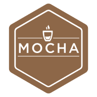

<p align="left"></p>

# MochaJS

MochaJS is a unit testing framework.  A unit test framework is a tool used during development.  Mocha can be used to test code that runs in NodeJS (back-end server environment) or in the browser (front-end client environment).

## Official resources

- **[Home](https://mochajs.org/)**
- **[Download](https://www.npmjs.com/package/mocha)**
- **[Documentation](https://mochajs.org/#table-of-contents)**

## NodeJS

1. When starting a new project, run `npm init` to generate a package.json file.
2. Install mocha and optionally, chai: `npm install --save-dev mocha [chai]`
3. Define a test script in the project's package.json: `"scripts": { "test": "mocha" }`. Use `mocha --require ts-node/register` to write tests in Typescript and compile on the fly. Note the module ts-node must be installed for this to work.
4. Mocha will look for tests in `./test/*.js`, override the default with a command line argument or a configuration object in package.json.  More on [command line usage](https://mochajs.org/#command-line-usage) and examples of [config files](https://github.com/mochajs/mocha/tree/master/example/config).

5. Define some tests.  Here is an example, call it `./test/sample.js`.
```javascript
// Use one of these assertion libraries
const assert = require('assert');
const assert = require('chai').assert
const assert = require('chai').expect
const assert = require('chai').should

// Import modules under test
const src = require('../src/index');

// Write some tests
describe('Describe ncscript...', function () {
  it('is a function', function () {
    assert.isNumber(src.myValueForPi);
  });
});
```

6. Here is some sample code to test, call it `./src/index.js`
```javascript
// Just export a constant to demonstrate the concept
exports.myValueForPi = 3.1415926;
```
7. Invoke mocha: `npm run test`


## In the Browser

The setup is a little different for testing in the browser.  Put an html file in the *test* folder (./test/mocha.html).  The sample html below loads the mocha css file, mocha framework, and the chai assertion library.  The last script element loads your test suite as an ES6 module.  This method makes a few assumptions about your test suite, more information below.

```html
<!-- ./test/mocha.html -->
<!DOCTYPE html>
<html lang="en">

<head>
  <meta charset="UTF-8">
  <meta name="viewport" content="width=device-width, initial-scale=1.0">
  <meta http-equiv="X-UA-Compatible" content="ie=edge">
  <title>Test</title>
  <link href="https://unpkg.com/mocha@7.0.0/mocha.css" rel="stylesheet" />
  <script src="https://unpkg.com/chai@4.2.0/chai.js"></script>
  <script src="https://unpkg.com/mocha@7.0.0/mocha.js"></script>
  <script type="module" src="test.js"></script>
</head>

<body id="mocha" style="padding: 30px;">
  <h1 style="color: #8D6748;font-size:xx-large;">Mocha Tests</h1>
</body>

</html>
```

This strategy keeps the html clean and makes the test setup and execution very explicit in the test file.  Follow this example:

```javascript
// ./test/test.js
import myCode from '../src/app.js';

function defineTests() {
  const assert = chai.assert;
  describe('Run a test', function () {
    it('returns true', function() {
      assert.isTrue(myCode.run());
    });
  });
}


(function RunTests() {
  mocha.setup('bdd');
  defineTests();
  mocha.checkLeaks();
  mocha.run();
})();

```

````javascript
// ./src/app.js
export default {
  run: function () {return true;}
}
```
